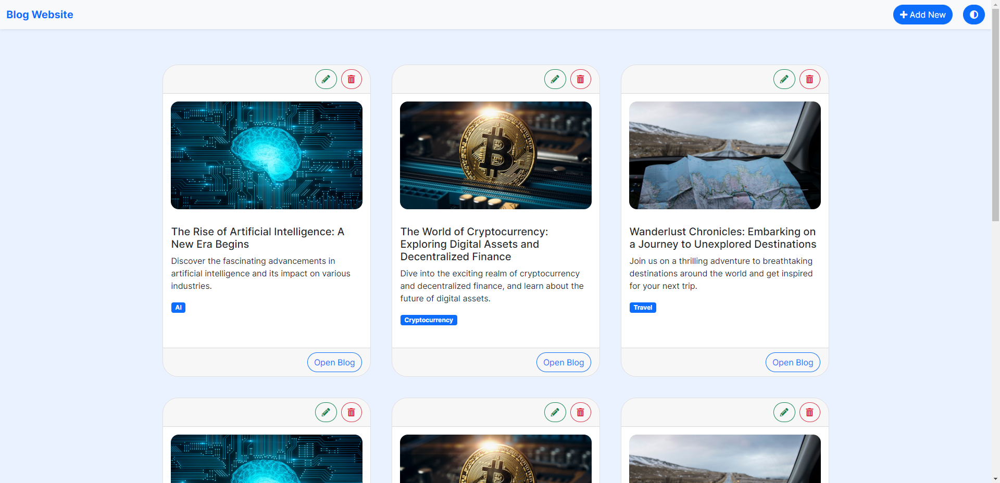
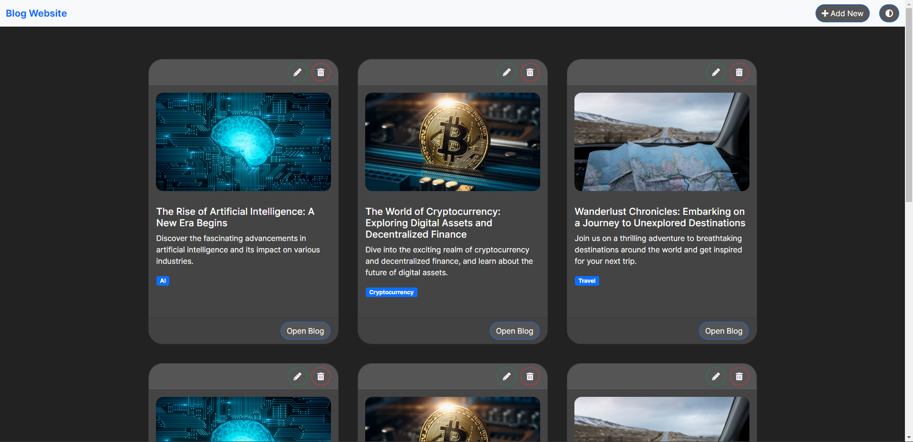

Visit Website: [Click Here](https://anayy09.github.io/Sample-Projects/Blog-Website/)

# Blog Website
Light Mode

<br>
Dark Mode


## About

The Sample Blog Website is a web application that allows users to create and manage their own blogs. It provides a user-friendly interface for writing and publishing blog posts, as well as reading and commenting on other users' posts. The website aims to provide a platform for sharing knowledge, opinions, and experiences through the medium of blogs.

## Features

- User registration and login functionality.
- Create, edit, and delete blog posts.
- Categorize blog posts into different topics or categories.
- Search functionality to find specific blog posts.
- Comment on blog posts and engage in discussions.
- Responsive design for seamless user experience across devices.

## Installation

1. Clone the repository:

   ```bash
   git clone https://github.com/your-username/sample-blog-website.git
   ```

2. Navigate to the project directory:

   ```bash
   cd sample-blog-website
   ```

3. Install the dependencies:

   ```bash
   npm install
   ```

4. Configure the database:

   - Create a MySQL database and update the database credentials in the `.env` file.
   - Run the database migrations:

     ```bash
     npx sequelize-cli db:migrate
     ```

5. Start the application:

   ```bash
   npm start
   ```

6. Access the application at `http://localhost:3000` in your web browser.

## Usage

1. Register a new user account on the website.
2. Log in with your credentials to access the dashboard.
3. Create a new blog post by clicking on the "New Post" button.
4. Fill in the title, content, and category of your blog post.
5. Click "Publish" to publish the blog post. It will be visible to other users.
6. Browse through the existing blog posts on the homepage and click on a post to read it.
7. Leave comments on blog posts by typing in the comment box and submitting it.
8. Use the search functionality to find blog posts related to specific topics or keywords.

## Contributing

Contributions are welcome! If you have any suggestions, bug reports, or feature requests, please open an issue or submit a pull request. Make sure to follow the project's code style and guidelines.

## License

This project is licensed under the [MIT License](LICENSE).

## Contact

For any questions or inquiries, feel free to contact me at [anay.sinhal@aol.com](mailto:anay.sinhal@aol.com).
